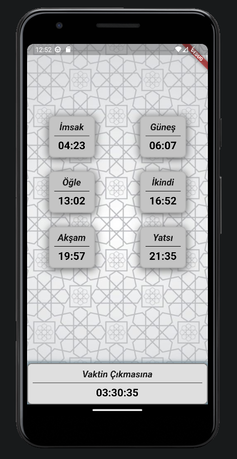

# Asal

Asal (Asal means honey in Arabic), is a Flutter application that aims to show and follow up pray times easily. It has a simple and plain UI and it's easy to use.

## Compile

I think you don't need something else. You can compile and run the source code by typing `flutter run` on the terminal. If you encounter an error, please open an issue.
